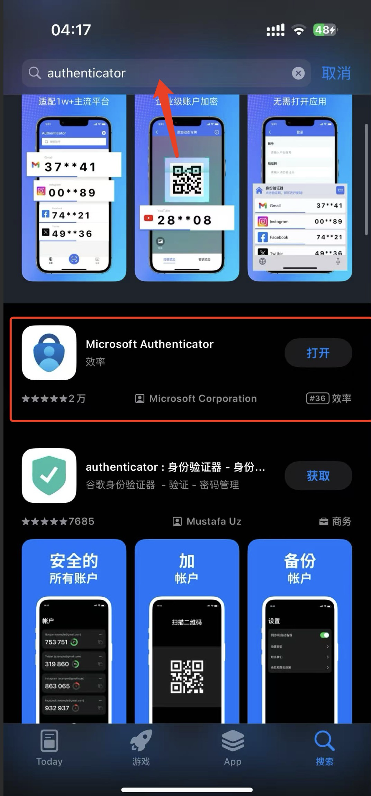

# 开启管理后台二步验证

为了增加管理后台安全性，当您不知道或处于新手阶段，不知道如何配置端口防火墙来增加安全性时，请务必打开二步验证登录以提高安全性。

1. 下载微软Authenticator或google authenticator这两款APP或是其他第三方二步验证工具, 本文以微软Authenticator进行演示。
2. 打开任意软件商店搜索authenticator, 找到Microsoft Authenticator进行下载。

<figure><figcaption></figcaption></figure>

3. 打开管理后台, 在设置中找到二步验证设置页面,  输入自定义标题及描述（输入的信息后续会在二步验证APP内显示以便识别）。

<figure><figcaption></figcaption></figure>

4. 输入完毕标题以及描述后,  点击生成验证器, 即可生成二步验证器二维码,  打开刚刚下载的Microsoft Authenticator， 点击APP右上角的添加按钮，选择任意类型进行扫码添加，添加后您的二步验证器就添加完毕了，后续管理后台登录都需要这里的验证码才可以登录后台。<mark style="color:red;">**注意：请务必保存好此二维码，丢失此二维码您将永远无法添加二步验证器。**</mark>

<figure><figcaption></figcaption></figure>

5. 此时APP内即可看到您的管理后台登录二步验证，刷新管理后台页面后续重新登录，输入账号密码验证通过之后，输入APP中的验证码即可登录。

<figure><figcaption></figcaption></figure>
